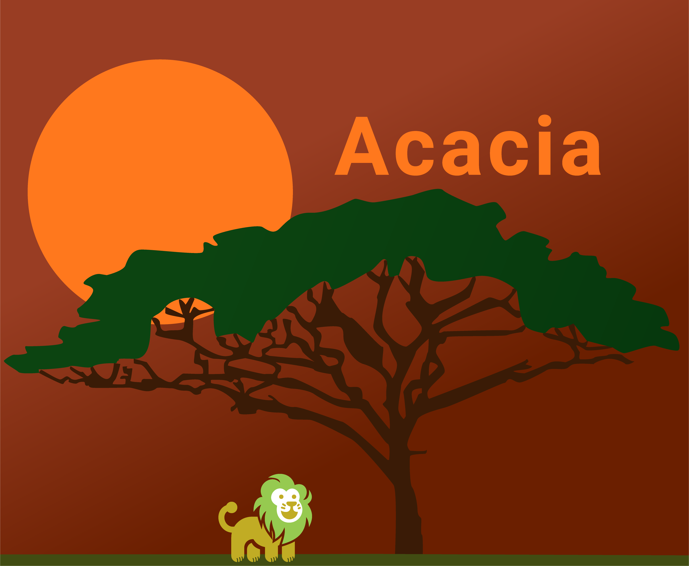

# Microkit Acacia

Acacia is a framework for easily generating seL4 Microkit system description files (SDFs) driven by a simple Python interface. This project succeeds [sdf_gen](https://github.com/au-ts/microkit_sdf_gen/). Acacia is implemented entirely in Python3.

Acacia is intended to be used as a part of a build system (see [sDDF examples](https://github.com/au-ts/sddf)). After compiling the relevant source code, Acacia helps developers compose compiled protection domains into a Microkit SDF using an *acaciafile* (formerly `metaprogram`).

As well as aiding composition of a collection of ELF files into a Microkit binary, Acacia allows developers to create *Subsystems* of various PDs such as driver classes, OS services and more. Acacia offers functionality for auto-generating instances of subsystems, connecting them with client programs, and injecting configuration data into compiled code.

## Setup

To install Acacia for development:
1. Create a virtual environment to store Acacia and its dependencies. `python3 -m venv (venv_name)`
2. Activate your virtual environment. `source (venv_name)/bin/activate`
3. Install dependencies. From the root directory of Acacia: `pip install -r requirements.txt`
4. Install Acacia to the virtual environment. From the root directory of Acacia: `pip install .`.

You now have Acacia installed and active in a virtual environment! Note that virtual environments are scoped to your current terminal, hence you must run `source (venv_name)/bin/activate` on each terminal where you intend to use it.

### Installing system-wide

If your OS has a non-system-managed Python3 installation, you can skip the virtual environment and simply `pip3 install .`. On MacOS and many Linux distributions, the system manages Python however.

### Installing from PyPi

Acacia is not yet on PyPi, but we will upload it once we reach our first stable release.

## Examples

The `examples/` subdirectory contains several simple scripts demonstrating the basic functioanality of Acacia.

## Testing

Acacia uses `pytest` for unit testing. Run `pytest` from the root directory to run tests. If you add new features, please ensure you contribute unit tests!
